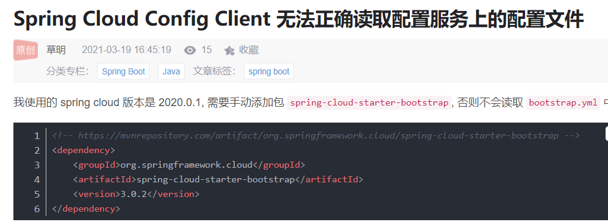
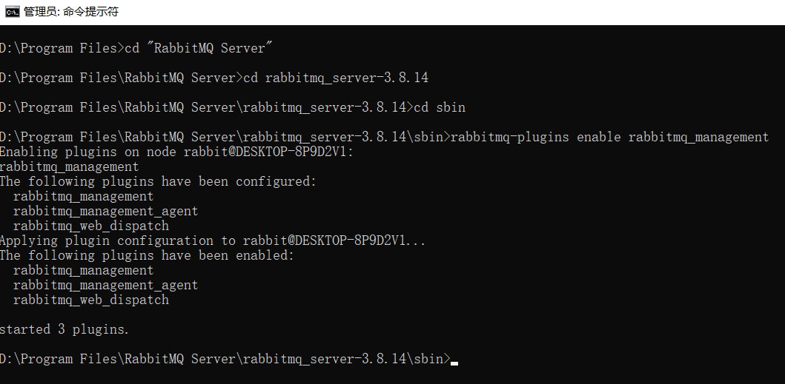
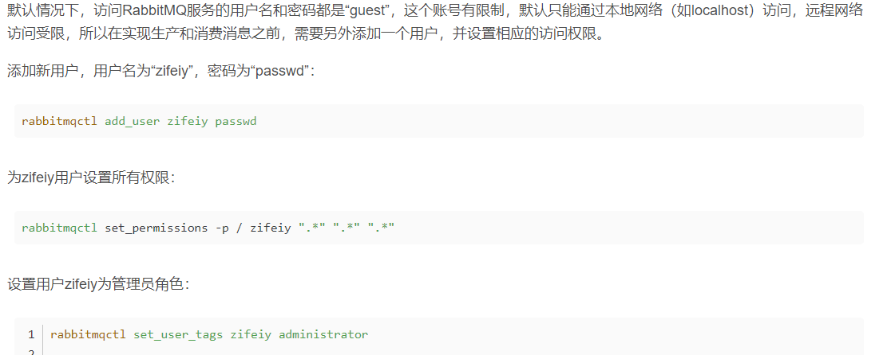
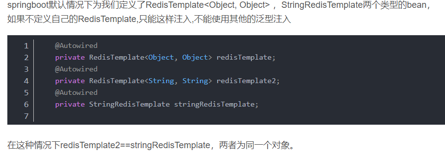
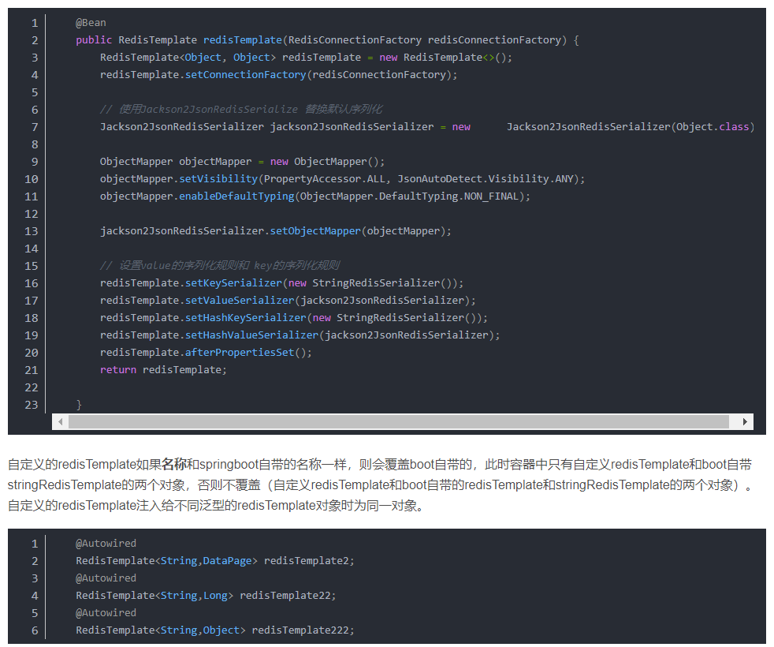

地址：https://www.cnblogs.com/xiaostudy/p/12729611.html

在此基础上集成了gateway，config和common

集成config时遇到的问题：
    1.https://blog.csdn.net/galoiszhou/article/details/115010058?utm_medium=distribute.pc_relevant_bbs_down.none-task-blog-baidujs-1.nonecase&depth_1-utm_source=distribute.pc_relevant_bbs_down.none-task-blog-baidujs-1.nonecase

    2.目前尚未解决，配置中心启动后，web和server读取配置中心的地址是IP地址，而不是localhost

安装redis: https://blog.csdn.net/qq_39915083/article/details/107034747

读取配置文件：https://www.cnblogs.com/sebastian-tyd/p/7895182.html

mongo连接：https://www.jianshu.com/p/f4d45568c74b

mongo集群搭建：https://www.jb51.net/article/152229.htm

有密码情况下的Mongo连接：https://www.jianshu.com/p/f4d45568c74b

springboot集成rabbitmq:https://www.cnblogs.com/sword-successful/p/10295561.html
启动后默认使用guest/guest访问，仅支持localhost访问： http://localhost:15672。 web站点默认端口15672。 rabbitmq默认端口5672

RabbitMQ生产者和消费者Java实现:
    https://blog.csdn.net/qq_18671415/article/details/105541434

二维码：https://www.jianshu.com/p/bb76ded47d64

springboot的RedisTemplate泛型自动注入问题:
    https://blog.csdn.net/hybluck/article/details/103615859

